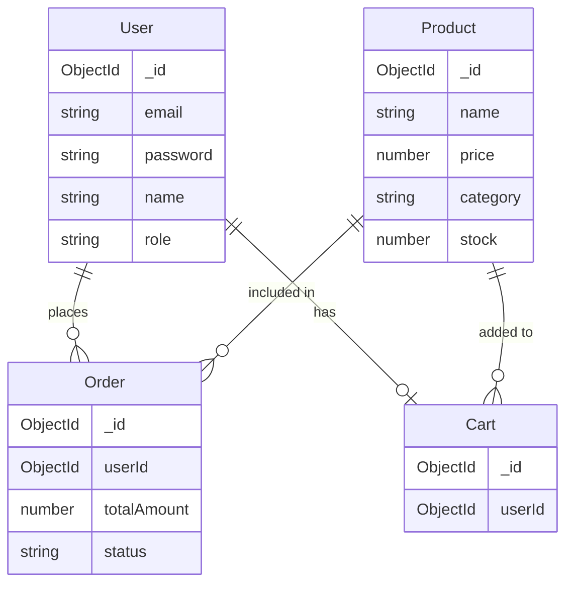

# StyleVerse - Entity Relationship Diagram

## Core Database Schema

## Core Entity Descriptions

### 1. User

- Primary entity for user management
- Stores user authentication and profile information
- Links to orders and cart

### 2. Product

- Core entity for product management
- Contains product details and inventory
- Links to orders and cart

### 3. Order

- Manages order information
- Links to user and products
- Tracks order status and payment

### 4. Cart

- Manages shopping cart functionality
- Links to user and products

## Core Relationships

### One-to-Many Relationships

1. User to Orders

   - One user can place multiple orders
   - Each order belongs to one user

2. Product to Orders
   - One product can be in multiple orders
   - Each order can contain multiple products

### One-to-One Relationships

1. User to Cart
   - One user has one cart
   - Each cart belongs to one user

### Many-to-Many Relationships

1. Products to Orders

   - Through order items
   - One product can be in multiple orders
   - One order can contain multiple products

2. Products to Cart
   - Through cart items
   - One product can be in multiple carts
   - One cart can contain multiple products
